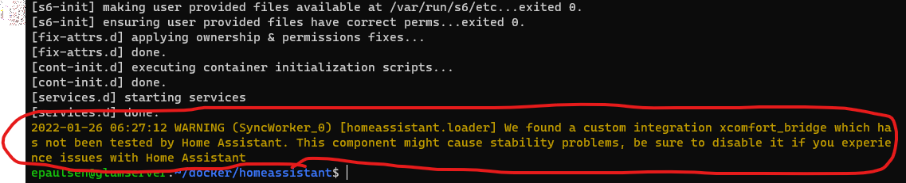
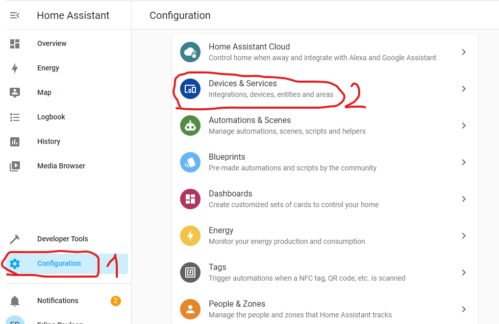
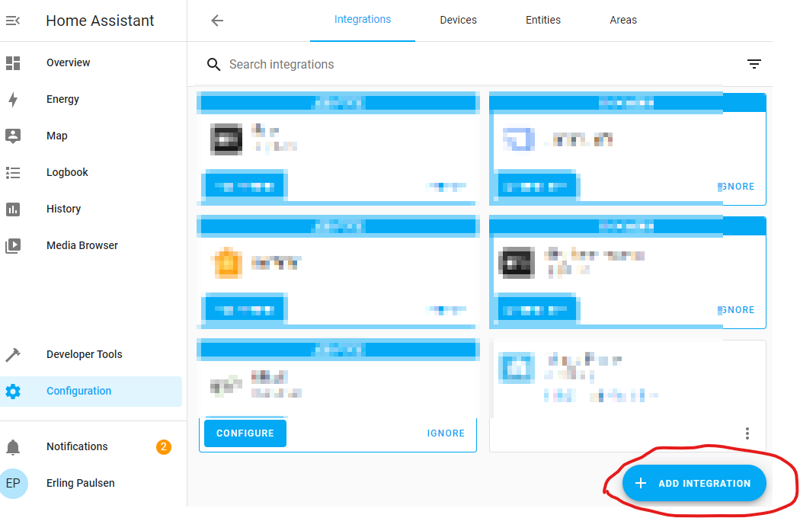
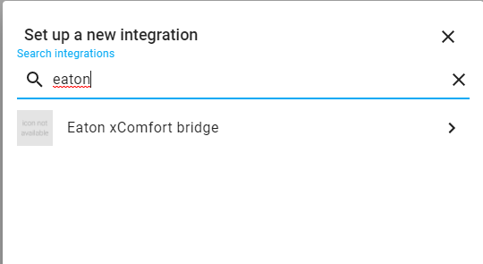
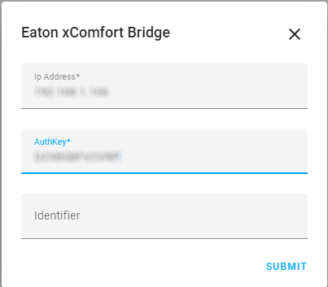

# xcomfort-bridge-hass

Eaton xComfort integration with Home Assistant. Note that you need the **xComfort Bridge** for this to work.

## Installation

**Step 1:** Clone or download this repository, then copy all the files and subfolders in `custom_components/xcomfort_bridge` to your homeassistant install directory, 
in the subfolder `config/custom_components/xcomfort_bridge`.  If done correct, your folder structure should look something like this:

If the `__pycache__` doesn't exist in your installation that is because it will be generated when python compiles the scripts in the folder, so please ignore that.
Also, the HomeAssistant installation used for this guide is running under docker, so folder placement will vary dependent on which environment you use to run HomeAssistant.

**Step 2:** Restart HomeAssistant.  HomeAssistant only scans the `custom_components` folder on startup.  If step 1 in this guide was done correct, you should find the following output in your homeassistant logs:

Again, the installation used in this example is running under docker.  To find your system logs, please refer to the HomeAssistant user guide.
If not specified, the log file is placed in `CONFIG/home-assistant.log`

**Step 3**:  Open HomeAssistant in browser, click "Configuration" and "Devices and services".

On the next screen, click "Add integration" at the bottom:

Search for "Eaton" and you should find the integration listed:

Enter the IP-address, authkey and an identifier for the integration.  Identifier is mandatory(not sure why the original developer put it in), but it is not used in the integration.  Authkey can be found on the bottom of your xComfort Bridge.

